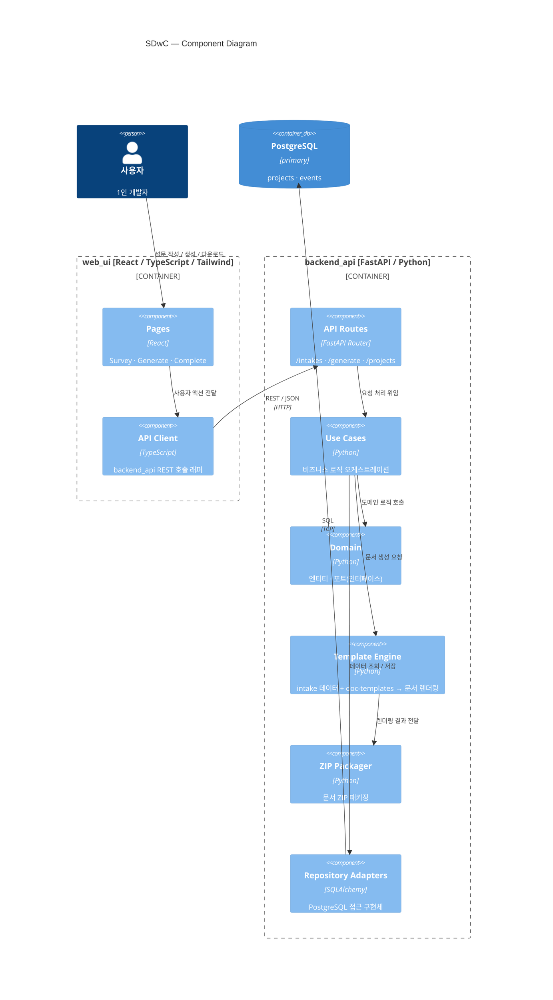

# Architecture

## Overview

- Pattern: monolith
- Reason: 서비스가 2개(backend_api, web_ui)뿐이고 MVP 단계라 단일 배포가 효율적.
- Internal Style: hexagonal
- Deployment: docker_compose

## Component Diagram

## Services

- **backend_api**
- **web_ui**

## Tech Stack

| Layer | Technology |
|-------|-----------|

| Backend Language | python |
| Backend Framework | fastapi |
| API Style | rest |
| Database (primary) | postgresql |

| Backend Deploy | docker |

| Frontend Language | typescript |
| Frontend Framework | react |
| CSS | tailwind |
| Frontend Deploy | same_server |

| Infra | docker_compose |

## Service Details

### backend_api

- Language: python
- Framework: fastapi
- API Style: rest
- Auth: none

- Databases:
  - postgresql — primary

- Deploy: docker

#### Endpoints

POST /intakes — 설문 데이터 저장
POST /generate — 문서 생성 트리거
GET /projects/:id — 프로젝트 메타 조회
GET /projects/:id/download — ZIP 다운로드

#### Data Entities

projects — 프로젝트 (설문 데이터 + 생성 상태)
events — 생성 이벤트 이력

### web_ui

- Language: typescript
- Framework: react
- CSS: tailwind
- Connected API: backend_api
- Deploy: same_server

#### Pages

Survey — 설문 입력 페이지
Generate — 문서 생성 페이지
Complete — 프로젝트 URL 안내 페이지

